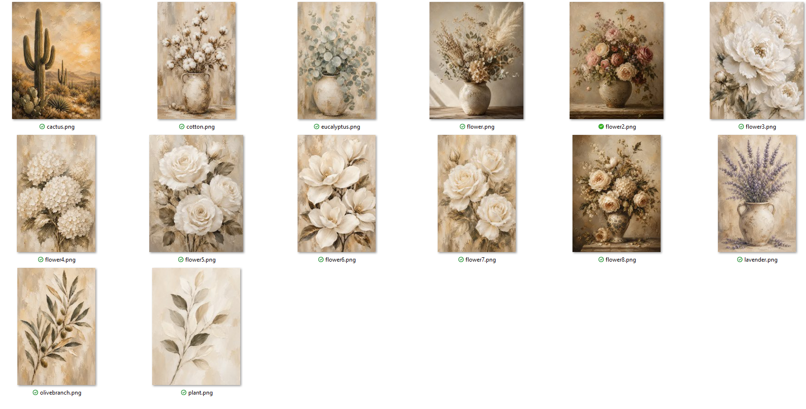

# 电商项目工作进展

**更新时间：2026年7月16日**

---

## 一、目前整体进度

目前主要工作集中在以下几个方面：

- 注册和准备各电商平台店铺
- 测试 eBay 产品上架及订单流程
- 调研不同平台的产品和市场情况
- 准备后续需要上架的产品和产品图片
- 建立产品图片和 Listing 制作流程
- 准备 Etsy 定制宠物画像产品
- 前期完成独立站基础搭建

### 各平台目前状态

| 平台 | 当前状态 |
| --- | --- |
| eBay | 已注册，已上传2个产品，账号审核中 |
| Temu | 已注册并通过验证，调研后暂时降低优先级 |
| Etsy | 注册进行中，等待银行卡 |
| Amazon | 等待银行卡后开始注册 |
| 独立站 | 基础网站已搭建完成，暂时降低优先级 |

### 现阶段主要方向

目前优先推进：

- eBay
- Etsy
- Amazon

主要目标是先利用这些平台本身的用户和流量测试不同类型的产品，根据实际数据判断哪些产品有市场需求。

Temu 和独立站现阶段暂时降低优先级，后续根据实际情况再继续推进。

---

# 二、eBay

## 当前进度

- eBay 店铺已经注册完成。
- 目前已经上传 **2个产品**。
- 每个产品提供 **4种尺寸选择**。
- 目前已经达到新店本月可以上传的额度上限。

## 第一笔订单

- 其中一个 Horse 产品上传后 **不到1小时**，在没有进行任何广告或宣传的情况下出了一单。
- 订单已经提交到生产端。
- 目前订单状态为 **备货中**，已经开始安排生产。

## 目前问题

- 第一笔订单产生后，eBay 对店铺进行了账号验证。
- eBay 要求上传身份证明（ID）。
- 我已经按照要求提交了相关资料。
- 目前账号状态为 **审核验证中**。
- 等审核通过后继续进行后续产品上架和店铺运营。

---

# 三、Temu

## 当前进度

- Temu 店铺已经完成注册。
- 身份验证已经通过。
- 目前暂时没有上传产品。

## 平台调查

我对 Temu 上的同类装饰画产品进行了一些调查，目前发现：

- 平台上的装饰画价格普遍非常低。
- 很多产品价格大约只有 **$1–$5**。
- 很多产品还提供免费配送。
- 大部分低价产品主要销售的是单独的画纸或海报，并不是可以直接挂起来的成品装饰画。
- Temu 用户整体对价格比较敏感，更偏向购买低价产品。

## 我的判断

我们目前的产品包含完整的画布成品，产品和生产成本比单独销售画纸高很多。

如果按照正常价格销售：

- 与 Temu 上大量低价产品相比没有价格优势。
- Temu 用户可能不愿意支付较高价格。

如果为了竞争大幅降低价格：

- 我们的成本较高。
- 利润空间非常小，甚至可能亏损。

## 目前计划

现阶段暂时降低 Temu 的优先级，把主要时间集中在：

- eBay
- Etsy
- Amazon

未来如果继续发展 Temu，可以考虑：

- 开发一些生产成本更低的产品。
- 例如只销售画纸或海报，不包含完整的 Canvas 成品。
- 使用低成本产品测试市场和积累店铺销量。
- 等店铺有一定基础以后，再逐渐增加利润更高的产品。

---

# 四、Amazon 和 Etsy 店铺注册

## Etsy

- Etsy 店铺目前已经注册到一半。
- 后续注册流程需要绑定银行卡。
- 目前正在等待银行卡寄到。
- 银行卡收到后会继续完成 Etsy 店铺注册。

## Amazon

- Amazon 注册同样需要银行卡。
- 目前暂时没有正式开始注册。
- 银行卡收到后会开始进行 Amazon 店铺注册。

---

# 五、产品上架流程准备

最近几天除了注册店铺以外，我主要在研究：

- eBay 适合销售哪些类型的装饰画。
- Etsy 适合销售哪些类型的产品。
- 如何提高产品图片和 Listing 的整体质量。
- 如何建立一个可以重复使用的产品上架流程。

## 产品 Listing 模板

目前已经制作了一套比较完整的产品展示方式。

每个产品包括：

- 1张原始设计图
- 6张产品展示图
- 产品标题
- 产品描述
- 产品关键词
- 其他 Listing 所需要的信息

下面是目前其中一个已经制作完成的 eBay 产品 Listing：

后续产品计划基本按照这个格式进行制作和上传，让整个店铺的产品展示保持统一。

## 产品制作模板

为了提高后续制作产品的效率，我制作了一套可以重复使用的产品制作模板。

目前一共有 **8个模板文件**：

- 7个模板用于根据一张原始设计图，制作不同用途的产品展示图片。
- 1个模板用于根据产品整理 Listing 所需要的信息，例如：
  - 产品标题
  - 产品描述
  - 产品关键词
  - 其他上架信息

简单来说：

**只需要准备好一张原始设计图，就可以按照这些模板快速制作出完整的产品图片和 Listing 信息。**

这样后续增加新产品时，可以减少大量重复工作，提高产品制作和上架效率。

---

# 六、目前准备的产品

这几天我也一直在制作和筛选后续准备销售的装饰画设计。

目前测试了多个不同的产品方向，例如：

- 动物
- 植物
- 版画
- 抽象艺术
- 陶瓷浮雕风格
- 酒吧 / 鸡尾酒主题
- 其他不同装饰风格

部分目前准备的产品如下：

## 后续产品策略

等店铺可以正常上架产品以后，我计划：

- 先从不同类型中各选择一部分产品进行上架。
- 使用统一的产品图片模板制作完整 Listing。
- 前期不直接大量制作单一类型的产品。
- 先测试不同类型产品的市场表现。
- 根据浏览量、点击量和实际销量判断消费者更喜欢哪些类型。
- 找到表现比较好的产品类型后，再增加类似产品。

目前我也对市场上的同类产品进行了对比。

从产品设计和图片展示质量来看，目前准备的产品整体有一定竞争力。

下一步最重要的是通过实际市场数据，测试哪些产品真正受到消费者欢迎。

---

# 七、Etsy 定制宠物画像

Etsy 方面，我目前准备首先测试 **定制宠物画像（Custom Pet Portrait）**。

## 产品模式

客户提供自己的宠物照片。

我根据客户选择的风格：

- 将宠物照片制作成对应风格的艺术画像。
- 客户确认后制作成实体装饰画。
- 最终将成品寄给客户。

## 目前准备

我已经提前制作了多种不同的宠物画像风格模板，让客户可以选择自己喜欢的风格。

目前已经准备大约 **20种不同风格**。

部分效果如下：

## 下一步

- 等银行卡收到。
- 完成 Etsy 店铺注册。
- 将定制宠物画像作为 Etsy 第一批重点测试的产品。
- 根据客户反馈和销售数据判断后续是否继续增加新的风格。

---

# 八、独立站

独立站是我前期主要进行的工作之一，目前网站的基础结构和主页已经基本完成。

## 已完成

- 网站整体搭建
- 首页设计
- 品牌基础视觉
- 产品页面结构
- 基础网站功能

## 后续调查

网站基本搭建完成以后，我进一步研究了独立站的运营和推广方式。

目前发现独立站与 eBay、Amazon、Etsy 最大的区别是：

- eBay、Amazon、Etsy 平台本身有用户和流量。
- 独立站本身没有自然流量。
- 网站做好以后，还需要另外解决客户来源的问题。

目前主要的推广方式包括：

### 免费推广

- Pinterest
- Instagram
- 其他社交媒体平台

这种方式基本没有广告成本，但是需要持续制作和发布内容，前期获得流量和订单的效率可能比较低。

### 付费推广

- Meta 广告
- 其他付费广告渠道

付费广告可以更快获得网站流量，但是需要额外投入广告费用，而且前期需要不断测试广告和产品。

## 目前计划

和老板沟通后了解到，国内目前也有人负责独立站相关工作。

同时，根据我对独立站推广方式的进一步调查，目前如果不投入广告费用，仅依靠免费的社交媒体推广，前期效率可能比较低。

因此现阶段：

- 暂时降低独立站的工作优先级。
- 保留目前已经完成的网站。
- 暂时不投入大量时间继续完善和推广。
- 将主要精力集中在 eBay、Etsy 和 Amazon。
- 优先利用这些平台现有的用户和流量测试我们的产品。
- 先通过实际销售数据判断哪些产品有市场需求。
- 后续如果有需要，再继续完善和推广独立站。

---

# 九、接下来的主要工作重点

接下来准备按照以下顺序继续推进：

1. 等待 eBay 完成账号验证。
2. 跟进目前已经产生的第一笔 eBay 订单。
3. 等待银行卡收到。
4. 完成 Etsy 店铺注册。
5. 开始 Amazon 店铺注册。
6. 将已经准备好的产品制作成完整 Listing。
7. 在 eBay、Etsy 和 Amazon 分批测试不同类型的产品。
8. 根据浏览量、点击量和实际销量判断哪些产品更受欢迎。
9. 根据实际销售数据决定后续重点开发的产品类型。
10. 暂时降低 Temu 和独立站的优先级，把主要时间集中在目前更适合测试产品的平台。

---

# 十、目前整体思路

现阶段我的主要目标是：

- 先完成 eBay、Etsy 和 Amazon 的账号和店铺基础设置。
- 建立稳定的产品制作和上架流程。
- 前期测试多个不同的产品类型，而不是直接大量投入单一类型。
- 利用平台现有流量测试产品的实际市场需求。
- 根据浏览、点击和销售数据找到表现更好的产品。
- 将后续时间和资源集中到有实际市场表现的产品类型。
- 暂时减少在 Temu 和独立站上的时间投入。
- 等主要平台和产品方向稳定以后，再考虑扩大其他销售渠道。