# 电商项目工作进展

**更新时间：2026年7月16日**

---

## 一、目前整体进度

| 平台 | 当前状态 |
| --- | --- |
| **eBay** | 已上传2个产品，已出1单，目前账号审核中 |
| **Etsy** | 注册进行中，等待银行卡 |
| **Amazon** | 等待银行卡后开始注册 |
| **Temu** | 已注册并通过验证，暂时降低优先级 |
| **独立站** | 基础网站已完成，暂时降低优先级 |

### 现阶段重点

- 优先完成 **eBay、Etsy、Amazon** 店铺。
- 准备并测试不同类型的装饰画产品。
- 根据实际浏览量和销量，决定后续重点发展的产品类型。

---

# 二、eBay

- 已完成店铺注册并上传 **2个产品**，每个产品有4种尺寸，目前已达到新店本月上架额度。
- Horse 产品上传后 **不到1小时，在没有广告和宣传的情况下出了一单**。
- 订单已经提交生产，目前正在备货。
- 出单后 eBay 要求进行身份验证，ID 已提交，目前等待审核。

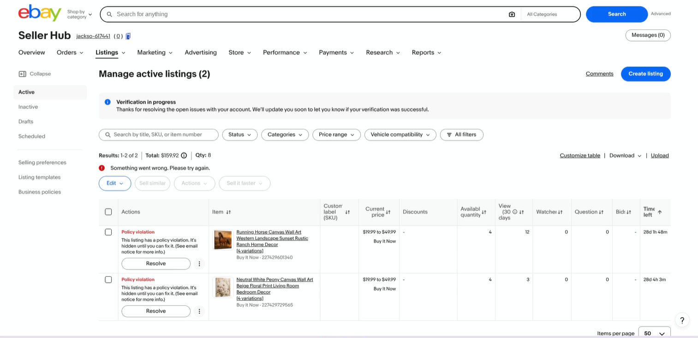

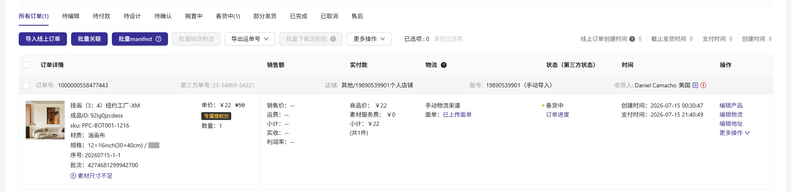

---

# 三、Temu

- 店铺已经注册并通过验证，目前没有上传产品。
- 调研发现平台同类装饰画很多只有 **$1–$5**，主要销售低成本画纸/海报，用户整体更偏向低价产品。
- 我们目前销售的是完整 Canvas 成品，成本较高，在 Temu 上直接进行价格竞争利润空间较小。

**目前决定：**

- 暂时降低 Temu 优先级。
- 未来可以考虑开发低成本画纸/海报产品测试市场和积累店铺销量。

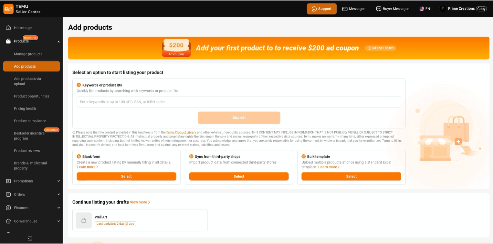

---

# 四、Amazon & Etsy

### Etsy

- 店铺注册进行中，目前等待银行卡。
- 银行卡收到后完成注册并开始上传产品。

### Amazon

- 同样需要银行卡完成注册。
- 银行卡收到后开始进行店铺注册。

---

# 五、产品准备

最近主要在准备后续 eBay、Etsy 和 Amazon 需要销售的产品。

### 产品上架流程

目前已经建立一套可以重复使用的产品制作流程：

- 1张原始设计图
- 6张产品展示图
- 自动整理产品标题、描述、关键词等 Listing 信息
- 后续新产品都可以按照同一套流程快速制作和上架

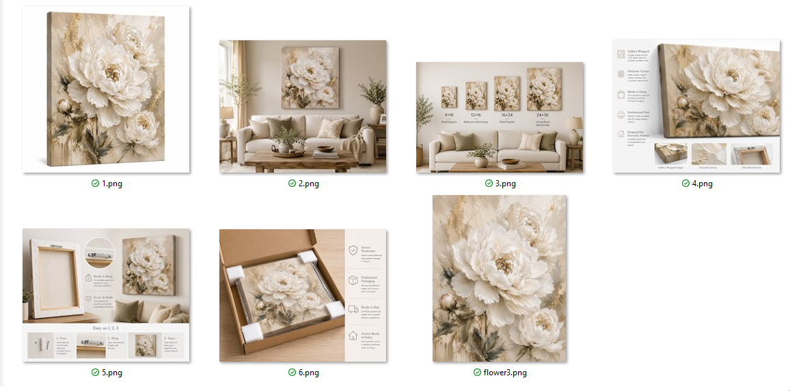

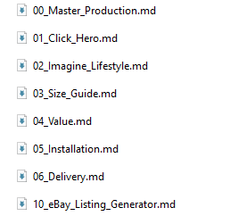

### 产品设计

目前已经准备了多个不同类型的装饰画，包括动物、植物、版画、抽象艺术、陶瓷浮雕、酒吧/鸡尾酒等方向。

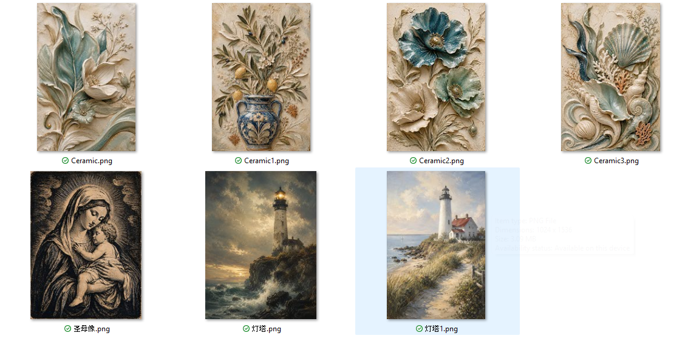

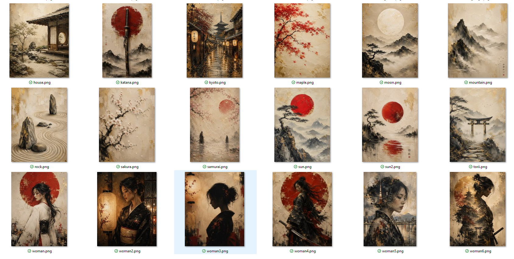

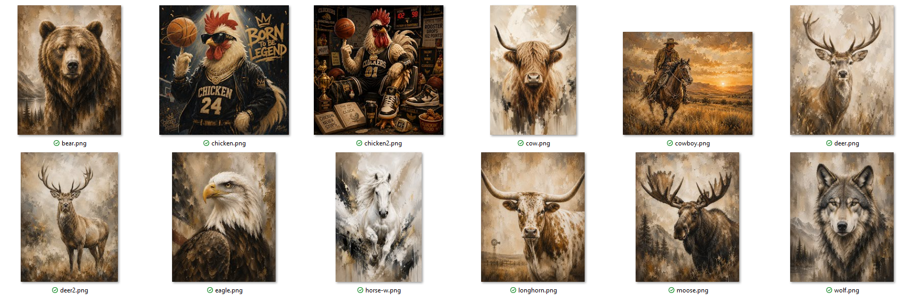

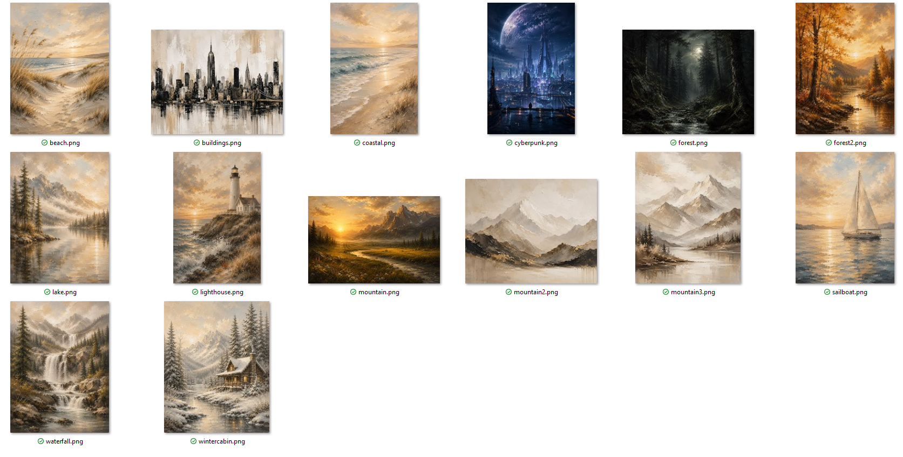

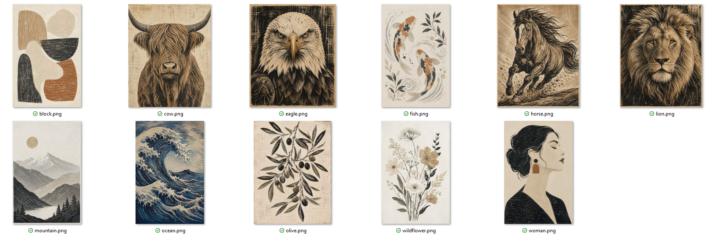

**后续计划：**

- 前期每个类型先上传一部分产品进行测试。
- 根据浏览量、点击量和销量判断哪些类型更受欢迎。
- 找到表现好的产品后，再重点增加同类型产品。

---

# 六、Etsy 定制宠物画像

Etsy 第一阶段准备重点测试 **定制宠物画像**：

- 客户提供自己的宠物照片。
- 客户从不同艺术风格中进行选择。
- 根据客户照片制作对应风格的宠物画像，并制作成实体装饰画。
- 目前已经提前准备约 **20种不同风格模板**。
- Etsy 店铺注册完成后准备作为第一批产品上线。

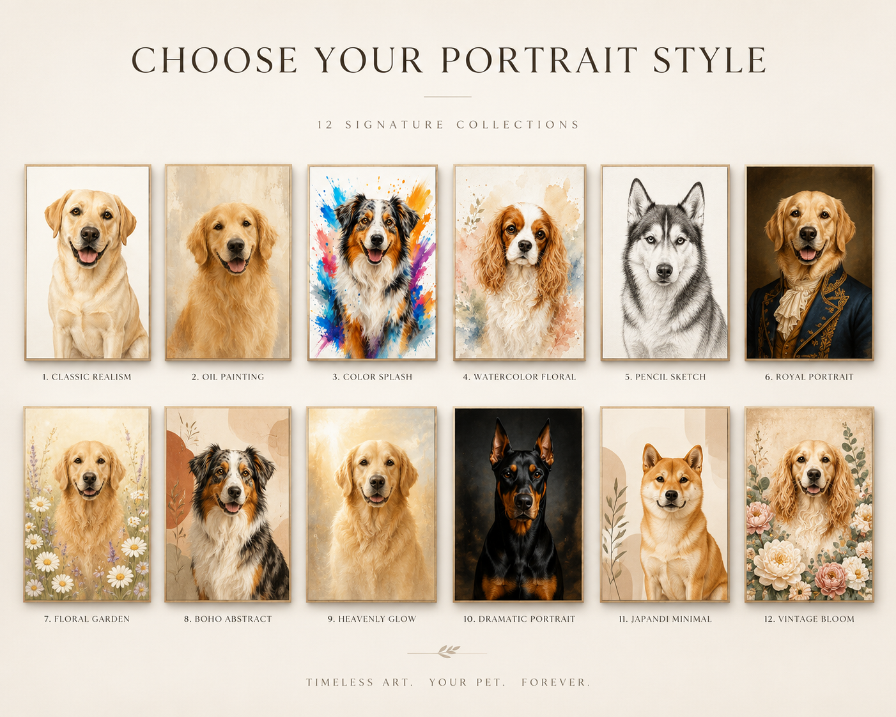

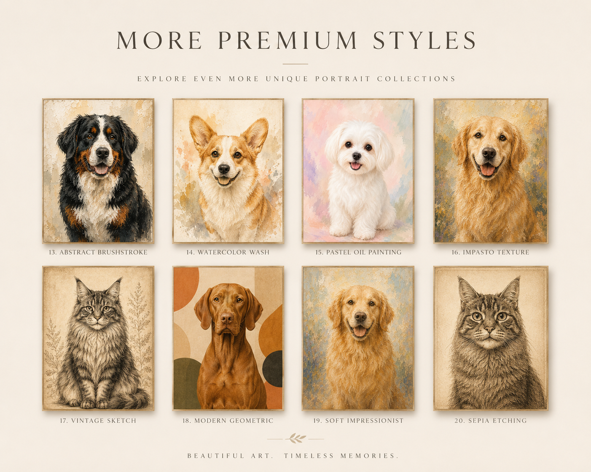

---

# 七、独立站

独立站是前期主要工作之一，目前基础网站已经基本完成。

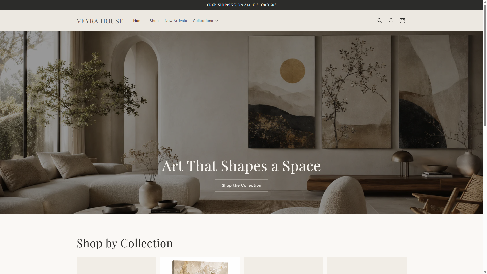

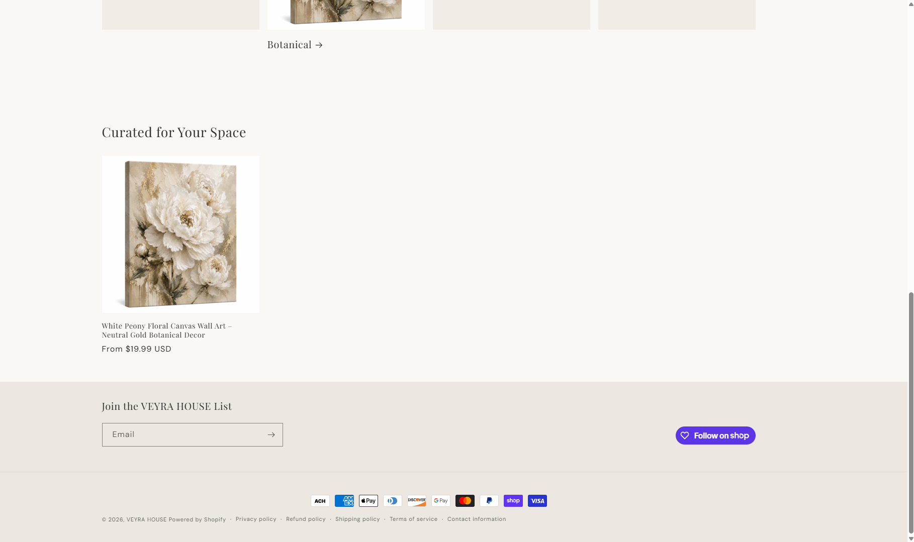

后续调查发现：

- 独立站本身没有平台自然流量，需要另外进行推广。
- Pinterest、Instagram 等免费推广方式成本低，但前期效率较慢。
- 付费广告可以获得流量，但需要额外广告预算和持续测试。

和老板沟通后了解到国内也有人负责独立站相关工作，因此目前暂时降低独立站优先级。

现阶段主要集中精力做好 **eBay、Etsy 和 Amazon**，利用平台现有流量先测试产品。

---

# 八、下一步计划

1. 等待 eBay 账号审核完成，继续上传和测试产品。
2. 跟进第一笔 eBay 订单。
3. 银行卡收到后完成 Etsy 注册并开始 Amazon 注册。
4. 上架已经准备好的不同类型装饰画。
5. 上线 Etsy 定制宠物画像产品。
6. 根据实际浏览、点击和销售数据筛选高潜力产品。
7. 将后续时间集中在表现更好的产品和平台。